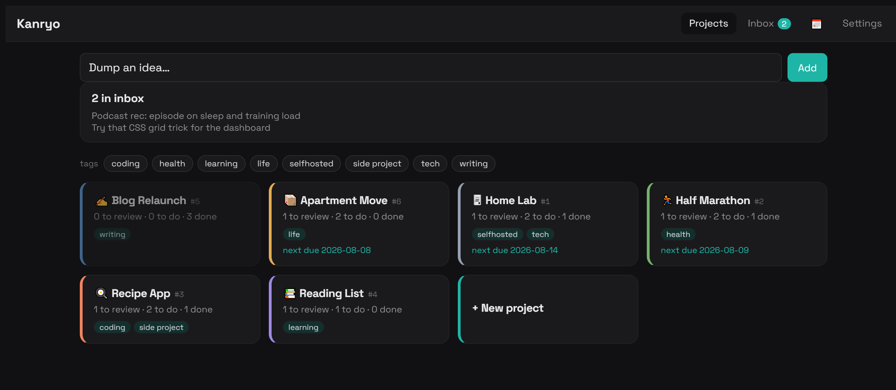
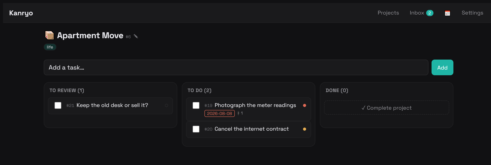
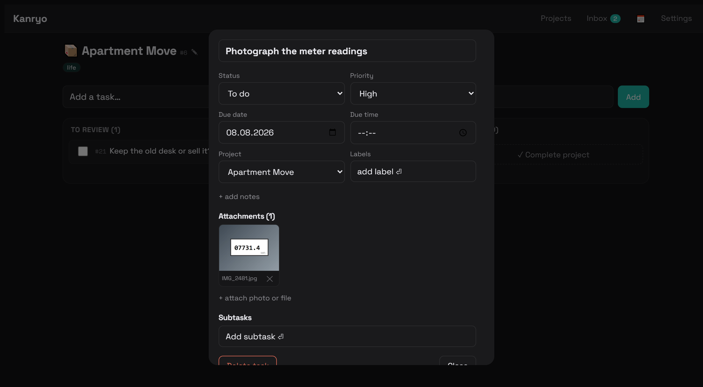
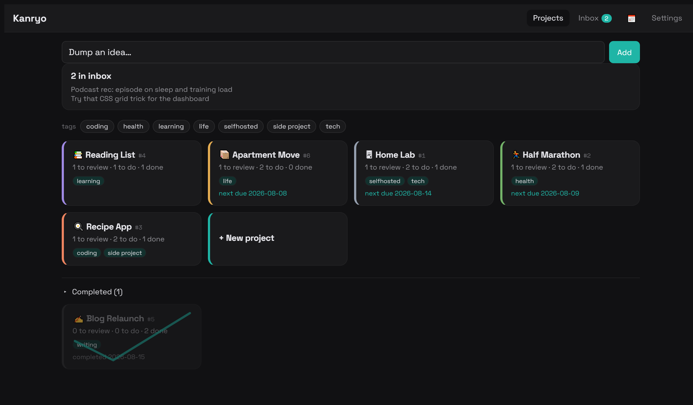

# Kanryo

A single-user project board that runs on Cloudflare's free tier and that Claude can
read and write from any surface — Claude Code, a claude.ai chat, or the phone app.

Capture an idea in five seconds, sort it into a project later, and let tasks with a
due date show up in Google Calendar. 完了 (*kanryo*) means "completed".



## Why this exists

Most task apps are built for teams and priced per seat. This one is deliberately
single-user: one password, one board, no accounts, no sharing, no sync service. It
costs nothing to run and the data stays in your own Cloudflare account.

The part that isn't ordinary: **Claude can use it as working memory.** The same
board you tap on your phone is available to Claude over MCP, so a chat can create a
project from something you just designed, mark a task done when work finishes, read
the notes you left months ago, or look at a screenshot you attached to a task.

## What it does

**Three states, not two.** Tasks are *To review*, *To do*, or *Done*. "To review"
is the point: it holds things you haven't committed to yet — the ones you still want
to think through, usually by talking them over with Claude. New tasks land there by
default.



- **Inbox** — a quick-add bar dumps a raw thought with no project, no fields. Sort it
  later with one tap. Text you type is mirrored to `localStorage` on every keystroke
  and held with a visible retry if the network is down, so a captured thought is never
  lost.
- **Projects** — description, tags, links (repo, live URL, a folder path, a Claude
  chat), a three-column board, drag and drop on desktop, segmented tabs on mobile.
- **Attachments** — photos and files on any task. Images are downscaled client-side
  before upload; Claude can view them.
- **Google Calendar** — a task with a due date becomes an event on a calendar you
  dedicate to it; completing the task removes the event. Reminders come from
  Google's own settings, so the app needs no notification system.
- **Completion** — finished projects drop into a collapsible drawer instead of
  cluttering the dashboard. Projects with no open work dim automatically.



## Stack

React 18 + Vite + TypeScript, Hono on Cloudflare Workers, D1 for data, R2 for
attachments, plain CSS with design tokens. No UI framework, no ORM, no state
library beyond TanStack Query. Installable as a PWA.

Everything fits inside Cloudflare's free tier at personal-use volumes.

## Setup

You need a Cloudflare account and Node 20+.

```bash
git clone https://github.com/Tobeiyyy/kanryo.git
cd kanryo
npm install
npx wrangler login
```

**1. Create the database and bucket**

```bash
npx wrangler d1 create kanryo
npx wrangler r2 bucket create kanryo-files
```

Copy the `database_id` that the first command prints into `wrangler.jsonc`,
replacing the one that is there.

**2. Apply the schema**

```bash
npm run migrate:remote     # and: npm run migrate:local  for local dev
```

**3. Set the secrets**

```bash
npx wrangler secret put APP_PASSWORD    # the password you will log in with
npx wrangler secret put AUTH_SECRET     # any long random string
npx wrangler secret put KANRYO_TOKEN    # long random hex; used by Claude, see below
```

On Windows PowerShell, piping a string into `wrangler secret put` appends a newline
and silently breaks the value — use `npx wrangler secret bulk secrets.json` instead.

**4. Deploy**

```bash
npm run deploy
```

Open the printed `*.workers.dev` URL, log in with `APP_PASSWORD`, and on a phone use
Share → *Add to Home Screen* to install it.

## Google Calendar sync (optional)

Kanryo writes to a calendar you dedicate to it, using a service account — no OAuth
flow, no refresh tokens.

1. In Google Cloud: create (or pick) a project, enable the **Google Calendar API**,
   create a **service account**, and download a **JSON key**. It needs no IAM roles.
2. Set two more secrets from that JSON:
   ```bash
   npx wrangler secret put GCAL_CLIENT_EMAIL   # client_email
   npx wrangler secret put GCAL_PRIVATE_KEY    # private_key, newlines included
   ```
3. In Google Calendar, create a new calendar, then share it with the service
   account's email address with **"Make changes to events"**.
4. Paste that calendar's ID into Kanryo's Settings page.

A task with a due date now appears on that calendar within seconds. A due time makes
it a 30-minute event; without one it is all-day. Completing or deleting the task
removes the event.

## Letting Claude use it

Kanryo exposes an MCP endpoint at `/mcp/<KANRYO_TOKEN>` with tools for listing,
creating and updating projects and tasks, filing inbox items, managing tags, and
viewing attachments.

**In claude.ai (web, desktop, mobile):** Settings → Connectors → add a custom
connector pointing at

```
https://<your-worker>.workers.dev/mcp/<KANRYO_TOKEN>
```

The token in the path is what authenticates it — treat that URL as a credential.

**Give Claude the behaviour, not just the tools:** upload [`skill/SKILL.md`](skill/SKILL.md)
as a skill (claude.ai → Settings → Capabilities → Skills, zipped in a folder named
`kanryo`). It teaches Claude when to offer to capture something, when to act without
asking, and how the three states are meant to be used. Replace the placeholder URL
inside it with your own first.

Then a chat can do things like:

> *"what's on my review list for the recipe app?"*
> *"we finished the offline mode — mark it done"*
> *"file this as a project with those four steps as to-dos"*



## Design notes

A few decisions that are deliberate, in case they look like omissions:

- **Single user by construction.** One shared password, one bearer token. Adding
  accounts would mean a user table, sessions, and per-row ownership — none of which
  a personal board needs.
- **No recurring tasks.** They were cut on purpose; a habit belongs in a habit
  tracker, not a project board.
- **No push notifications.** Google Calendar already does reminders well.
- **Calendar sync is written failure-first.** Any change that affects an event marks
  the task dirty *in the same database write*, then converges in the background; a
  crash mid-sync leaves the flag set, and the next app load retries. Deleted tasks
  leave a tombstone so their event can still be removed.
- **`consider` on the wire.** The UI says "To review" but the stored status value is
  still `consider` — renaming it would mean rebuilding the table for a label.

## Development

```bash
npm run dev        # vite + worker, local D1
npm test           # vitest
npm run check      # typecheck
```

The dev server uses a local database, so you can seed whatever you like without
touching your real board.

## License

MIT — see [LICENSE](LICENSE).
