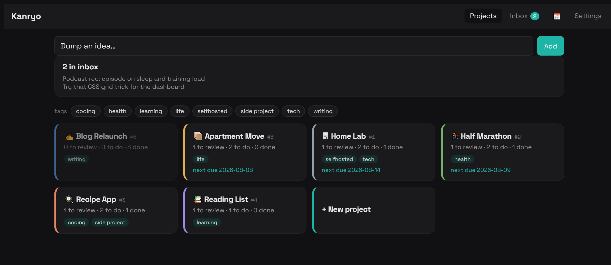
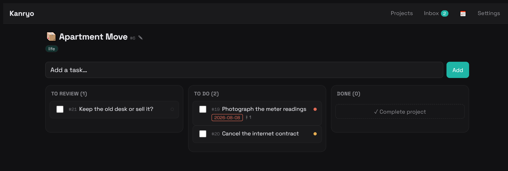
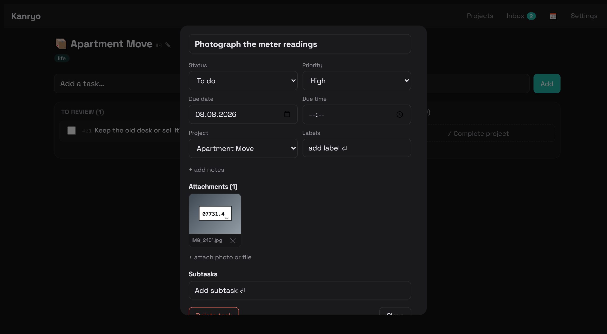
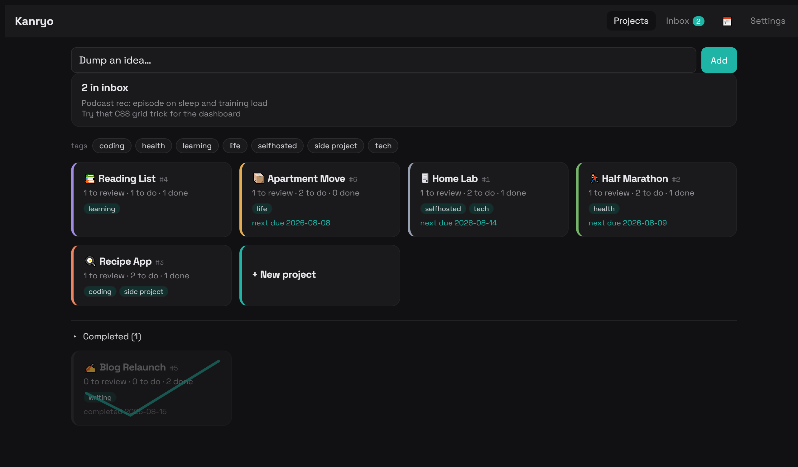

# Kanryo

If you combine a kanban board, a notes inbox and Claude's memory you would probably
get something like Kanryo. It is a project board for exactly one person, it runs on
Cloudflare's free tier, and it serves an MCP endpoint so every Claude surface reads
and writes the same board I tap on my phone.

完了 (*kanryo*) means "completed".



## Why I built this

I did not need a team tool. I needed a place to throw ideas at 11pm without filling
in five fields first, and I wanted Claude to still know about them next week.

Chats forget. Claude Code forgets. I got really tired of re-explaining my own projects to a model that helped me build
them, so the board became an overarching memory instead. A chat can look up what is still open,
close a task when we finish something, or read a note I wrote in June and completely
forgot about. Similarly Cowork can obviously also look this up.

## What it does

Tasks sit in three columns: to review, to do, done. New ones land in "to review",
which is my way of saying I have not committed to this yet. That column turned into
a list of things I want to talk through with Claude first, this way I am not afraid 
to add lots of new ideas, because half of mine are probably not doable and claude 
will tell me immediately if it is something already made, something doable, or something
that is not possible.



Capture is one box at the top of the dashboard. Type the thought, hit send, thats it
It's made with as little friction as possible so you are able to capture your ideas
as soon as they happen and can instantly rest assured they are there whenever you 
want to discuss them deeper. No confirm button. It lands in an inbox and gets sorted 
later, by me in one tap or by Claude when I ask it to triage. You can even set up a 
scheduled task for this weekly or so.

Whatever you type is mirrored to localStorage on every keystroke and
kept with a visible retry if the request fails.

Projects hold a description, tags and links: a repo, a live URL, a folder path on
your machine, a Claude chat. Tags group related projects and filter the dashboard.

Tasks have priorities, labels, subtasks, due dates and attachments. Photos and
files go to R2, images get downscaled in the browser first cause a 6MB phone photo
helps nobody. Claude can actually look at the attachments. I screenshot a bug on
my phone, attach it, and a chat two days later can see exactly what I saw. Paste a
screenshot straight into an open task with Ctrl+V. PDFs, Word and Excel files come
back to Claude as text, scanned PDFs as page images. Files that belong to a whole
project rather than one task (a brief, a spec) go in the project's Files section.

A Pulse page shows every active project side by side, sorted by how much is still
undecided.

Speaking of phone - bookmark the URL of your Kanryo as a PWA on your home screen, 
synced and able to store your ideas wherever you are. Plus it looks as clean as it 
does on desktop aswell!

Give a task a due date and it appears as an event on a Google Calendar you set
aside for it. Finish the task, the event disappears. All the reminding is Google's
job, so this app sends no notifications at all.

Finished projects fold into a drawer at the bottom of the dashboard. Projects with
nothing open left just fade out where they stand, useful for projects you know you will
have no feature ideas about.



## Stack

React 18, Vite, TypeScript, Hono on Cloudflare Workers, D1, R2, plain CSS with
design tokens. TanStack Query is the only real frontend dependency. At one person's
volume everything fits in the free tier.

## Install

About 10 minutes. Everything runs in your own Cloudflare account on the free tier.

### What you need

- A free [Cloudflare account](https://dash.cloudflare.com/sign-up).
- [Node.js](https://nodejs.org) 20 or newer (`node -v` to check) and git.
- Two one-time switches in the Cloudflare dashboard, which the setup can't flip
  for you:
  1. **Workers & Pages**: open it once and pick your workers.dev subdomain. Your
     app will live at `kanryo.<that-subdomain>.workers.dev`.
  2. **R2 Object Storage**: open it and enable R2 (this is where attachments
     live). Cloudflare may ask for a payment method even though Kanryo's usage
     stays inside the free tier.

### 1. Get the code

```bash
git clone https://github.com/Tobeiyyy/kanryo.git
cd kanryo
npm install
```

### 2. Log in to Cloudflare

```bash
npx wrangler login
```

A browser window opens; allow access and come back to the terminal.

### 3. Run the setup

```bash
npm run setup
```

It creates the database and the file bucket, applies the schema, deploys the app
and sets its secrets. It asks you for one thing, a login password (press Enter to
have one generated). At the end it prints three things. Save them somewhere safe:

- your app URL
- your login password
- your **Claude connector URL**, which contains a secret token, so treat it like
  a password

If anything fails, the script tells you which step and why, and it is safe to run
again. It reuses what already exists and never replaces secrets you already have.

### 4. Open it

Open the app URL and log in. On a phone: open the URL, log in, then Share, "Add
to Home Screen". It installs like an app.

<details>
<summary>Manual setup, if you'd rather do every step yourself</summary>

```bash
npx wrangler d1 create kanryo          # put the printed database_id into wrangler.jsonc
npx wrangler r2 bucket create kanryo-files
npm run migrate:remote
npm run deploy
npx wrangler secret put APP_PASSWORD   # what you log in with
npx wrangler secret put AUTH_SECRET    # any long random string
npx wrangler secret put KANRYO_TOKEN   # long random string, used by Claude
```

Your connector URL is then `https://kanryo.<subdomain>.workers.dev/mcp/<KANRYO_TOKEN>`.

Windows note: piping a string into `wrangler secret put` in PowerShell appends a
newline and quietly corrupts the value. Type it at the prompt instead, or use
`npx wrangler secret bulk secrets.json` with a small JSON file.

</details>

### Updating later

```bash
git pull
npm install
npm run migrate:remote
npm run deploy
```

## Google Calendar (optional)

Kanryo writes to one calendar you set aside for it through a service account, so
there is no OAuth flow and nothing to refresh. This is the fiddliest part of the
whole setup, and it is skippable.

1. In [Google Cloud Console](https://console.cloud.google.com): pick or create a
   project, enable the Google Calendar API, create a service account, and download
   a JSON key for it. It needs no IAM roles.
2. Make a file `gcal.json` next to the code, copying two values out of that key
   file exactly as they are (the private key keeps its `\n` escapes):
   ```json
   { "GCAL_CLIENT_EMAIL": "<client_email>", "GCAL_PRIVATE_KEY": "<private_key>" }
   ```
   then upload both at once and delete the file:
   ```bash
   npx wrangler secret bulk gcal.json
   ```
   (`gcal.json` is gitignored.) Pasting the multi-line key into
   `wrangler secret put` usually breaks it, which is why this goes through a file.
3. In Google Calendar: create a calendar, open its settings, share it with the
   service account's email address, and give it "Make changes to events".
4. In the same settings, copy the calendar's **Calendar ID** and paste it into
   Kanryo's Settings page.

Due dates then show up on that calendar within seconds. With a time it becomes a
30 minute event, otherwise all day.

## Connect Claude

Two parts: the **connector** gives Claude the tools to read and write your board,
the **skill** tells it how to behave with them.

### The connector

The worker serves MCP at `/mcp/<KANRYO_TOKEN>`: the connector URL the setup
printed. The token in the path is the authentication, so treat the whole URL
like a password.

- **claude.ai (web, desktop and phone apps):** Settings > Connectors > Add
  custom connector. Give it the name `Kanryo`, paste the connector URL, leave
  the OAuth fields empty, and save. It then works in every chat on every device
  signed in to that account.
- **Claude Code:** if you're signed in with the same claude.ai account, the
  connector shows up there too. Otherwise add it directly:
  ```bash
  claude mcp add --transport http kanryo https://kanryo.<subdomain>.workers.dev/mcp/<KANRYO_TOKEN>
  ```

### The skill

Then there is [`skill/SKILL.md`](skill/SKILL.md), and I would argue it matters more
than the tools do. It tells Claude to close a task the moment you say you finished
it, no asking, but to always ask before creating or deleting anything. My first
version asked permission for every single write. I stopped using it within a day.

1. In `skill/SKILL.md`, replace `YOUR-WORKER.workers.dev` with your app's address.
2. **claude.ai:** put the file in a folder called `kanryo`, zip that folder, and
   upload the zip under Settings > Capabilities > Skills.
3. **Claude Code:** copy the file to `~/.claude/skills/kanryo/SKILL.md`
   (on Windows `%USERPROFILE%\.claude\skills\kanryo\SKILL.md`).

### Check it works

Start a new chat and ask *"what's in my Kanryo inbox?"*. Claude should call the
Kanryo tools and answer (with an empty inbox on a fresh install). After that a chat
can handle "what is on my review list for the recipe app" or "we finished the
offline mode, mark it done".

Chats that were already open when you added or changed the connector keep the old
tool list. Start a new one.



## Saved Reddit posts (optional)

Claude can't open reddit.com links, so saving a post "for later" never helped much. Kanryo
can read your saved posts through Reddit's private RSS feed, which needs no API app:

1. On old.reddit.com/prefs/feeds, turn on "enable private RSS feeds" and copy the URL of
   the **saved** feed.
2. Store it as a secret (the token in it works like a password):
   ```bash
   npx wrangler secret put REDDIT_SAVED_FEED
   ```

Claude can then list and search your last 100 saves, read one in full, and copy one into
the inbox so it's still there after you unsave it.

## Decisions that might look like gaps

One password, one bearer token, that is the whole auth model. Accounts would mean a
user table, sessions and per-row ownership, for exactly one user. No.

Recurring tasks are missing on purpose. I tried them, hated the noise, and moved my
habits somewhere else entirely.

No push notifications either, for a duller reason: Google Calendar already sends
them and I refuse to build a second thing that pings my phone.

Calendar sync writes its failure state first. Any change that affects an event
marks the task dirty in the same database write, then converges in the background.
If the worker dies halfway, the flag survives and the next app load retries.
Deleted tasks leave a tombstone so their event still gets cleaned up.

## Troubleshooting

- **Login says wrong password right after setup:** new secrets take up to a minute
  to reach the Worker. Wait and try again.
- **claude.ai says registering with Kanryo's sign-in service failed when adding
  the connector:** you're on an old version. Update (see "Updating later"); the
  worker now tells claude.ai there is no OAuth to set up.
- **Claude says Kanryo isn't connected:** check the connector is switched on for
  that chat, and start a new chat after adding it.
- **The setup stops at R2 or at the deploy:** it names the step; almost always
  one of the two dashboard switches under "What you need" is missing.
- **Forgot the password:** `npx wrangler secret put APP_PASSWORD` sets a new one.

## Development

```bash
cp .dev.vars.example .dev.vars   # local secrets; the login password is "dev"
npm run migrate:local            # create the local database
npm run dev                      # vite plus the worker against the local D1
npm test                         # vitest
npm run check                    # typecheck
```

The dev server uses a local database, so seed it with whatever nonsense you like.

## Who this is for

If you just want a kanban board there are a hundred better maintained ones. The
people who will get something out of Kanryo are the ones already living half their
projects inside Claude, who are tired of every chat starting from zero. For that
specific problem, this is the best tool I know of, mostly because I built it around
exactly that annoyance.

## License

MIT, see [LICENSE](LICENSE). If Kanryo ends up being useful to you, there's a
[Ko-fi](https://ko-fi.com/tobeiyyy).
